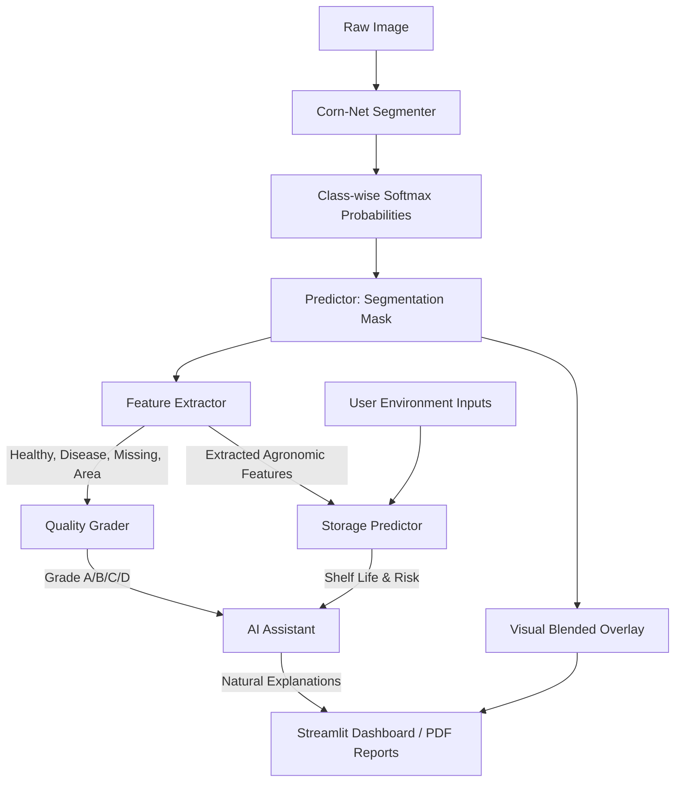

# AgroGrow — AI-Driven Smart Post-Harvest Corn Quality Assessment and Storage Prediction System

AgroGrow is an end-to-end, modular post-harvest decision-support system built for corn classification, grading, and storage shelf-life prediction. It employs a custom deep learning semantic segmentation model (**Corn-Net**), physical simulation environmental modeling for shelf life, an expert AI assistant, and an interactive Streamlit dashboard.

---

## 🏗️ Architecture Diagram



---

## 📁 Project Folder Structure

```
AgroGrow/
├── dataset/                     # Parsed images & synthesized labels
│   ├── images/                  # Normalized raw image splits (train/val/test)
│   └── masks/                   # Binary/multi-class classification labels (PNG)
├── models/                      # Deep Learning & Loss abstractions
│   ├── corn_net.py              # Corn-Net segmentation PyTorch module
│   └── loss.py                  # Dice & Hybrid Loss formulas
├── training/                    # Trainer logic
│   └── trainer.py               # Custom training loop (AMP, checkpointers)
├── prediction/                  # Inference, extraction & grading
│   ├── predictor.py             # Inference wrappers
│   ├── feature_extractor.py     # Crop metrics math calculations
│   └── grader.py                # Quality classification boundaries
├── storage_prediction/          # Machine learning regression models
│   ├── dataset_generator.py     # Synthesizes degradation database
│   └── model.py                 # RF & XGBoost training & prediction
├── assistant/                   # Explanatory interfaces
│   └── agent.py                 # Rules-based and OpenAI agent wrappers
├── utils/                       # Shared helpers
│   ├── logger.py                # Global logging configuration
│   ├── prepare_dataset.py       # HSV pseudo-mask generator
│   └── report_generator.py      # ReportLab PDF compiler
├── reports/                     # Saved PDF quality assessments
├── results/                     # Metric plots, history records, overlays
├── weights/                     # Saved .pth (PyTorch) and .pkl (scikit-learn) binaries
├── tests/                       # Testing module
│   └── run_tests.py             # Execution unit tests
├── config.py                    # Centralized settings configuration
├── train.py                     # DL training launcher
├── predict.py                   # Prediction CLI launcher
├── app.py                       # Streamlit dashboard interface launcher
├── requirements.txt             # Setup dependencies
└── README.md                    # System documentation
```

---

## ⚙️ Installation Guide

### Prerequisites
- Python 3.10+
- CUDA-compatible GPU (optional, but highly recommended for fast training; fallback to CPU is supported automatically)

### Setup Steps
1. Navigate to the project root directory:
   ```bash
   cd D:/Sem_7/"research paper 1"/AgroGrow
   ```

2. Create a virtual environment and activate it:
   ```bash
   python -m venv venv
   # On Windows (PowerShell)
   .\venv\Scripts\Activate.ps1
   # On Linux/macOS
   source venv/bin/activate
   ```

3. Install project dependencies:
   ```bash
   pip install -r requirements.txt
   ```

---

## 🌽 Training Guide

### 1. Preprocess & Validate Dataset
The original workspace contains raw images only. To build the segmentation target directories, copy files, and generate HSV-based pseudo-masks, run the data preparation entrypoint. This will automatically execute the Phase 2 dataset validation check and output a validation report:
```bash
python prepare_dataset.py
```
*Outputs:*
- Copy of images resized to 256x256 under `dataset/images/`
- Custom labels under `dataset/masks/` (0=Background, 1=Healthy, 2=Missing, 3=Diseased)
- Markdown report at `reports/dataset_validation_report.md`

### 2. Run DL Training (Corn-Net)
Train the segmentation model. The script automatically sets up data loaders, learning rate schedulers, early stopping, mixed precision training (on CUDA), checkpoints, and outputs metric charts:
```bash
python train.py
```
*Outputs:*
- Best validation model saved to `weights/best_model.pth`
- Regular training checkpoint saved to `weights/checkpoint.pth`
- Validation curves saved to `results/training_metrics_curves.png`

### 3. Generate Storage Prediction Database & Train Regressors
Since the raw dataset has no shelf-life records, run the generator script to synthesize environmental storage stability data, then train the Random Forest and XGBoost regressors:
```bash
# 1. Synthesize storage training data
python storage_prediction/dataset_generator.py

# 2. Train and choose best regressor
python -c "from AgroGrow.storage_prediction.model import train_storage_models; train_storage_models()"
```
*Outputs:*
- Training data file saved to `dataset/storage_data.csv`
- Best regression model saved to `weights/best_storage_model.pkl`
- Model comparison chart saved to `results/storage_model_comparison.png`

---

## 🔮 Prediction & Inference Guide

### 1. Running CLI Assessments
Evaluate any raw corn image using the command line interface:
```bash
python predict.py --image "dataset/images/test/some_file.jpg" --temp 28.0 --humidity 72.0 --storage "Hermetic Bag" --query "Why is this corn Grade B?"
```
*Outputs:*
- Segmentation overlay saved to `results/{filename}_overlay.png`
- Detailed metric stats and AI Assistant reply printed in the terminal
- Report compiled and saved at `reports/{filename}_quality_report.pdf`

### 2. Running the Interactive Streamlit Dashboard
Launch the dashboard to perform drag-and-drop assessments, view analytics charts, download PDF reports, and chat with the AI assistant:
```bash
streamlit run app.py
```

---

## 🧪 Testing Suite
Execute the testing suite to verify system integrity, dimensions, losses, and grading calculations:
```bash
python tests/run_tests.py
```
