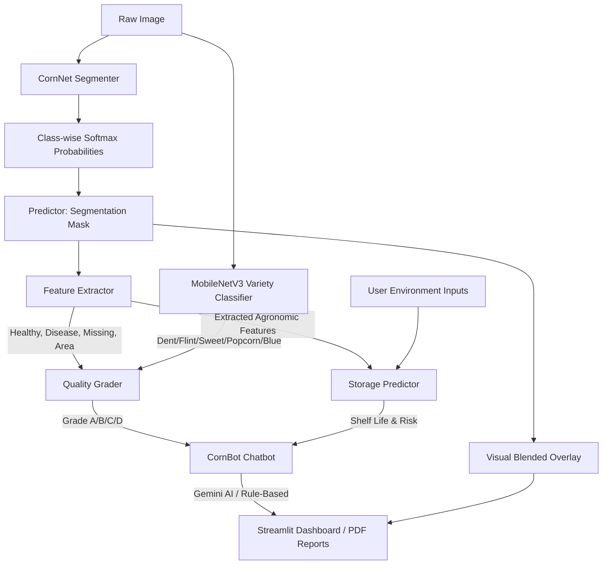

# AgroGrow — AI-Driven Smart Post-Harvest Corn Quality Assessment and Storage Prediction System

AgroGrow is an end-to-end, modular post-harvest decision-support system built for corn classification, grading, and storage shelf-life prediction. It employs a custom deep learning semantic segmentation model (**CornNet**), a fine-tuned **MobileNetV3** corn variety classifier, XGBoost shelf-life regression, a **Gemini AI-powered chatbot**, and an interactive Streamlit dashboard.

---

## 🌟 Key Features

| Feature | Description |
|---|---|
| 🔬 **Semantic Segmentation** | CornNet classifies every pixel into Healthy / Missing / Diseased / Background |
| 🌈 **5-Variety Detection** | MobileNetV3 CNN identifies Dent, Flint, Sweet, Popcorn, Blue/Black corn |
| 📊 **USDA/ISO Grading** | Automatic Grade A/B/C/D classification with detailed summary |
| 📦 **Shelf-Life Forecast** | XGBoost regressor predicts shelf life under Open Air / Cold Storage / Hermetic Bag |
| 🏥 **Health Status Banner** | Instant visual notification — Healthy / Warning / Severe / No Corn Detected |
| 💬 **CornBot AI Chatbot** | Gemini-powered (or rule-based) chatbot floating at bottom-right |
| 📄 **PDF Report Export** | One-click branded quality assessment reports |

---

## 🏗️ Architecture Diagram



---

## 📁 Project Folder Structure

```
AgroGrow/
├── dataset/                     # Training dataset (1,387 labelled corn images)
│   ├── images/                  # Normalised image splits (train/val/test)
│   └── masks/                   # Pixel-level semantic labels (PNG)
├── variety_data/                # Corn variety classifier pipeline
│   ├── raw/                     # Downloaded variety images (5 classes × ~150 each)
│   ├── splits/                  # Train/val split for MobileNet training
│   ├── build_variety_dataset.py # Scrapes variety images from Bing
│   ├── train_variety_classifier.py  # MobileNetV3-Small fine-tuning script
│   └── variety_classifier.py   # Inference wrapper (auto-loaded by predictor)
├── models/                      # Deep Learning & Loss abstractions
│   ├── corn_net.py              # CornNet segmentation PyTorch module
│   └── loss.py                  # Dice & Hybrid Loss formulas
├── training/                    # Trainer logic
│   └── trainer.py               # Custom training loop (AMP, checkpointers)
├── prediction/                  # Inference, extraction & grading
│   ├── predictor.py             # Inference wrappers (CNN variety + segmentation)
│   ├── feature_extractor.py     # Pixel-level agronomic feature extraction
│   └── grader.py                # USDA/ISO quality grade classification
├── storage_prediction/          # XGBoost shelf-life regression
│   ├── dataset_generator.py     # Synthetic degradation database generator
│   └── model.py                 # XGBoost training & prediction
├── assistant/                   # AI Chatbot
│   ├── chatbot.py               # CornBot (Gemini AI + rule-based fallback)
│   └── agent.py                 # Legacy compatibility redirect
├── utils/                       # Shared helpers
│   ├── logger.py                # Global logging configuration
│   ├── prepare_dataset.py       # HSV pseudo-mask generator
│   ├── dataset.py               # PyTorch Dataset + overlay generator
│   ├── metrics.py               # IoU / F1 / Dice evaluation
│   ├── validation.py            # Validation loop
│   └── report_generator.py      # PDF report generation (ReportLab)
├── weights/                     # Trained model weights
│   ├── best_model.pth           # CornNet segmentation model
│   ├── best_storage_model.pkl   # XGBoost shelf-life model
│   └── variety_classifier.pth  # MobileNetV3 variety classifier (after training)
├── docs/                        # Documentation
├── reports/                     # Generated PDF reports
├── tests/                       # Unit test suite
│   └── run_tests.py             # All 7 unit tests
├── app.py                       # Streamlit dashboard entry point
├── train.py                     # CornNet segmentation trainer
├── config.py                    # Global configuration
└── requirements.txt             # Python dependencies
```

---

## 🚀 Quick Start

### 1. Install Dependencies
```bash
pip install -r requirements.txt
```

### 2. (Optional) Enable Gemini AI Chatbot
```bash
# Get a free API key at https://aistudio.google.com
export GEMINI_API_KEY=your_key_here       # Linux/Mac
$env:GEMINI_API_KEY = "your_key_here"    # Windows PowerShell
```

### 3. Run the Dashboard
```bash
cd "d:/Sem_7/research paper 1"
python -m streamlit run AgroGrow/app.py
# OR from within AgroGrow/:
..\venv\Scripts\streamlit run app.py
```

### 4. Access at: http://localhost:8501

---

## 🌈 Corn Variety Detection

AgroGrow detects **5 corn varieties** using a two-tier system:

| Variety | Detection Method | Notes |
|---|---|---|
| 🌽 **Dent Corn** | Default / CNN | Most common worldwide |
| 🎨 **Indian / Flint Corn** | CNN + Ruby/Purple HSV bands | Glass Gem, Bloody Butcher, Calico |
| 🍬 **Sweet Corn** | CNN + White-ratio LAB | Pale cream/yellow, wrinkled when dried |
| 🍿 **Popcorn** | CNN + Manual selection | Small hard pearl-white kernels |
| 🔵 **Blue / Black Corn** | CNN + Dark-blue HSV bands | Hopi Blue, Black Aztec |

**When `variety_classifier.pth` is trained and present**, the system uses **MobileNetV3 deep learning** for all variety detection. Otherwise it falls back to colour-grading automatically.

### Build Variety Dataset & Train Classifier
```bash
# Step 1: Download ~200 images per variety from Bing
python variety_data/build_variety_dataset.py --images_per_class 200

# Step 2: Train MobileNetV3-Small (GPU recommended, ~15-20 min)
python variety_data/train_variety_classifier.py --epochs 25 --batch_size 16
```

---

## 🔬 Segmentation Classes

| Class | Colour in Overlay | Meaning |
|---|---|---|
| Background | Transparent (no colour) | Non-corn regions |
| Healthy | 🟢 Green | Fully formed, disease-free kernels |
| Missing | 🔵 Blue | Empty kernel sockets / kernel loss |
| Diseased | 🔴 Red | Fungal rot, mould, necrosis |

---

## 📊 Quality Grading (USDA / ISO Aligned)

| Grade | Min Healthy | Max Disease | Max Missing |
|---|---|---|---|
| **Grade A** | ≥ 88% | ≤ 4% | ≤ 4% |
| **Grade B** | ≥ 75% | ≤ 8% | ≤ 10% |
| **Grade C** | ≥ 55% | ≤ 16% | ≤ 18% |
| **Grade D** | < 55% | > 16% | > 18% |

---

## 💬 CornBot AI Chatbot

CornBot is a floating chatbot (bottom-right corner of the dashboard). It:
- Answers questions about **corn varieties, disease, storage, and grading**
- Has **full context** of the current analysis (grade, disease %, shelf life, variety)
- Uses **Gemini AI** when `GEMINI_API_KEY` is set (dynamic, LLM-quality answers)
- Falls back to an **enhanced rule-based system** without a key (still context-aware)

---

## 🧪 Running Tests
```bash
python tests/run_tests.py
# Expected: ALL 7 UNIT TESTS PASSED SUCCESSFULLY!
```

---

## 📦 Storage Prediction

Shelf life is predicted by an **XGBoost regressor** trained on simulated degradation data:

| Storage Type | Typical Shelf Life | Conditions |
|---|---|---|
| Open Air | 30–90 days | 20–35°C, 65–80% RH |
| Hermetic Bag | 180–365 days | Sealed, low oxygen |
| Cold Storage | 365–1825 days | -20°C to +10°C |

---

## 🗃️ Dataset

- **1,387 labelled corn images** with pixel-level segmentation masks
- Split: 70% train / 15% val / 15% test
- Classes: Background (0), Healthy (1), Missing (2), Diseased (3)
- **716 variety classification images** across 5 classes (Bing-scraped)

---

*AgroGrow — Precision Post-Harvest Intelligence for Corn.*
